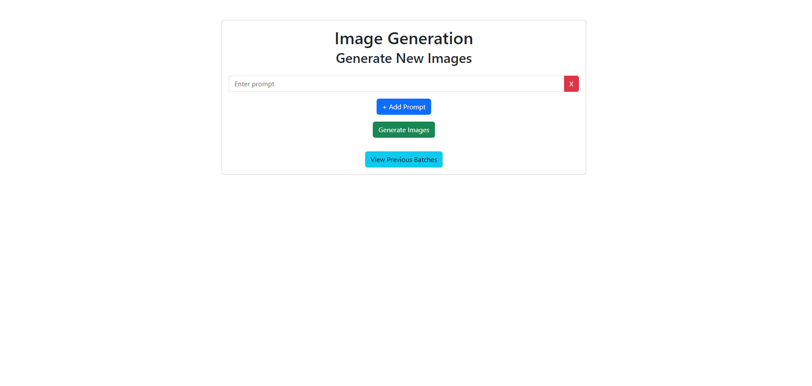
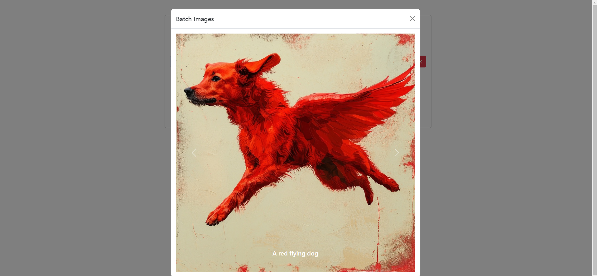
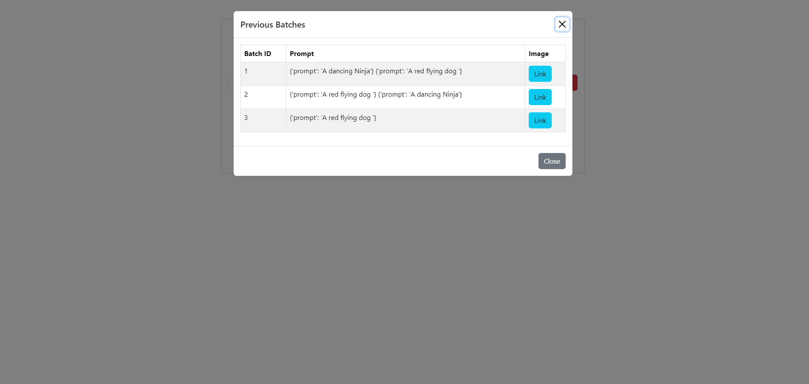

### Functionalities

1. **Generate Images from Multiple Prompts**: Users can add multiple prompts from the frontend and generate images for all of them simultaneously. After the generation process is complete, a modal will open displaying the images in a carousel format.

2. **Batch Saving**: Generated images are saved in batches on the backend for efficient management.

3. **View Previous Batches**: Users can access previously generated batches by clicking on the "View Previous Batches" option.

4. **View Batch Images**: Clicking "View Previous Batches" will open a modal with all previously generated batches. Users can select an image link to open another modal that displays the images from that batch in a carousel. Navigation options allow users to view the next or previous image, with the corresponding prompt displayed at the bottom.

### Samples

1. ***Home***

    

3. ***Generated Image for prompt A Red flying Dog***

    

2. **Previous Batches***
    

